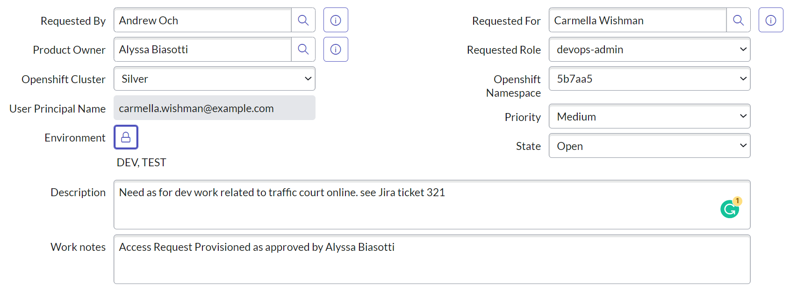
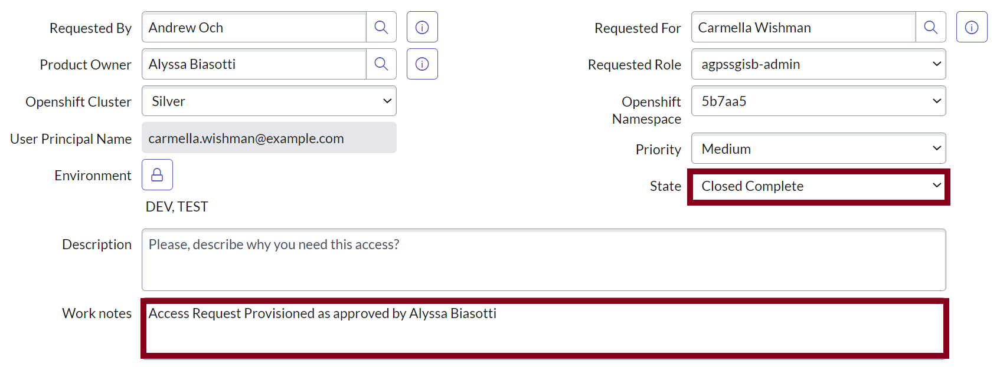
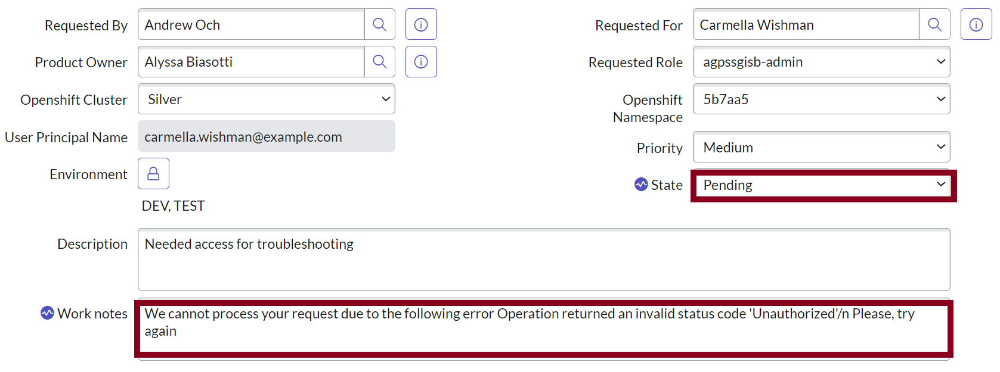

# access-request-manager

## Solution Architecture

## Actors
- Requestor
- Approver

### Workflow
- User submit openshift access request by filling the aar form in servicenow
- User then set the request state to in progress
- Once the request state changes to in progress, an approval request will be sent to the product owner and admin
- The approver can approves or deny the request
- if either of the approvers approves the request
	- The request state is set to approved
- If the approver deny the request, 
	- The approves state is set to rejected

### Event Sourcing
- All the aboove work flows generate an individual change events into a kafka topic (topic name = prefix.aar_table_name) and corresponding schema into the Apicurio Shema Resitry as published by serviceNow kafka connector source
- The user manager service subscribes to this topic and consumes all generated change event
- Un-approved state change events are ignored and offset auto committed by the consumer by a dedicated consumer group
- Approved state change events are processed and a corresponding RBAC manifest are generated based on the submitted approved request
- The generated RBAC manifest is pushed to the Git RBAC manifest repository to be handles by argo cd for deployment to target openshift enviornment
- The result of this process will be published to the access-request-result topic for analysis
- The result will be used to notify the user the state of their request wheather it was succefully or not. The is acchived by updating the aar form work note and state fields via serviceNow tableAPI service request with the result from the access-request-result topic
- If the result is a success, the work note field will be updated with a "user access request provisioned note" and state set to "close completed" 
	
- If the result is a failure, the work note field will be updated with the corresponding failure message and state set to pending for possible user resubmission 
		

